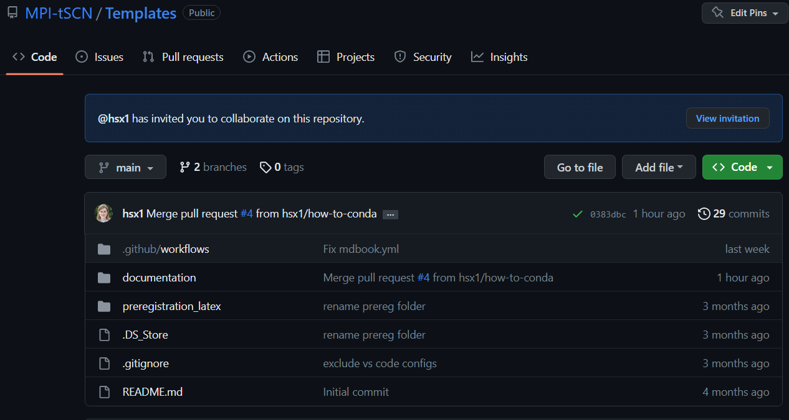
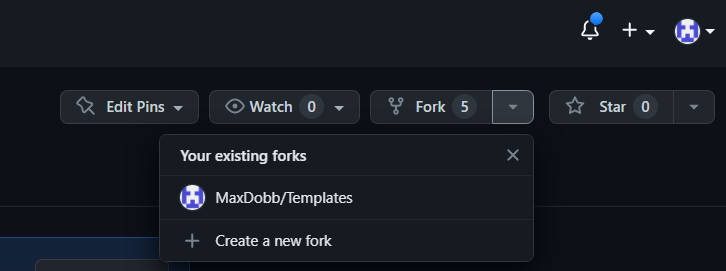
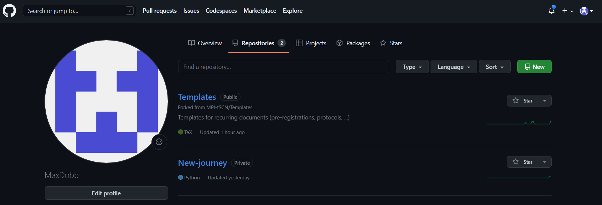
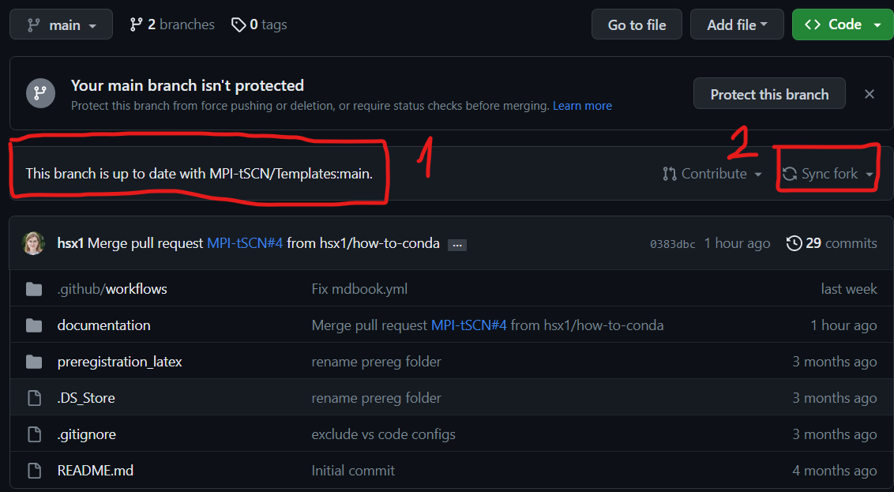
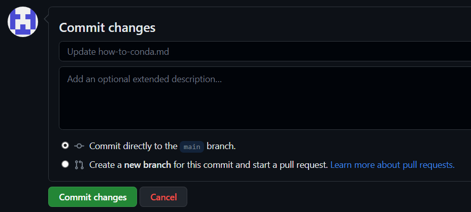
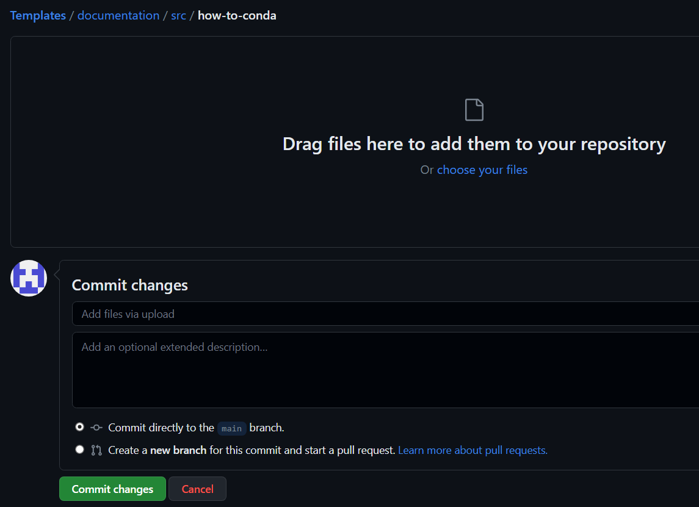
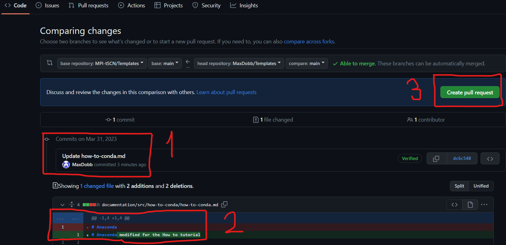

# GitHub pull request tutorial

Once you have created your github account, you have acces to many options : 

- Create repositories
- Access other repositories
- Request pulls

# Here we will look at pull requests :

## First steps

### **For this you will have to go on [github.com](http://github.com) on your browser**

- First things first go to the main repository you want to work on :

**We will be working on the MPI-tSCN’s repository called “Templates” (see on top left of the screenshot)**

**The easiest way is to do the changes and the pull request online**

- You will have to fork the repository you want to work on :
    - At the top right click on “fork”, I have already forked this repository so it shows it as “<username>/<fork_name>

- Once you forked the repository, go to **YOUR** repository by clicking on your profile picture on the top right of the webpage, you will then see your personal repositories :

- If you now click on “Templates”, it will open the fork, a copy, of the repository you want to modify
    - You can now modify “Templates” in your private repositories **WITHOUT** interacting with the main “Templates” branch
        
        
        
        **Always make sure that your forked branch is up to date with the main one, if not go to “Sync fork”**
        
- You now have an up to date modifiable version of the protected main branch

### Now you are free to modify whatever you would like to, let’s say I want to edit the markdown file under *Templates/Documentation/src/how-tos/conda/conda.md*

**You can check in the ‘1’ area that you are in your personal repository and not the main branch. The ‘2’ area is used to edit the file.**

- Click on the pen marked ‘2’ on the screen above and modify the document as you please. Once it’s done : scroll down and do click on “commit changes”

## Add files or documents

let’s say you want to add a file under *Templates/Documentation/src/how-to-conda/*

- simply go to the “add file” section and “Upload file”

### Note that the files have to be in a specific format :

- For tutorials : put them in Templates/documents/src/how-tos
    - Create a new folder called <name of your tutorial> (ex: conda for “anacondas”)
    - **NEVER use capital letters or spaces**
- inside this new folder :
    - put a ‘main.md’ file for the markdown page you did
    - put an ‘img’ folder for the images in .png or .jpg and the pdf contained in the markdown page

## Pull request

### Once the changes are done, we can move on to the Pull request :

- Go to the “Pull request” tab and “New pull request” :

- Then check the changed documents and the changes that were made :

**’1’ shows the modified documents, ‘2’ shows the actual changes. Once everything looks fine to you, you can tap ‘3’ “Create pull request”** 

- This pull request will have to be reviewed and accepted by an admin of the MPI-tSCN github group.
- Once the pull request is accepted, you will get a notification.

# Please do not forget to sync your forked version of the repository after each pull request and before adding any changes.