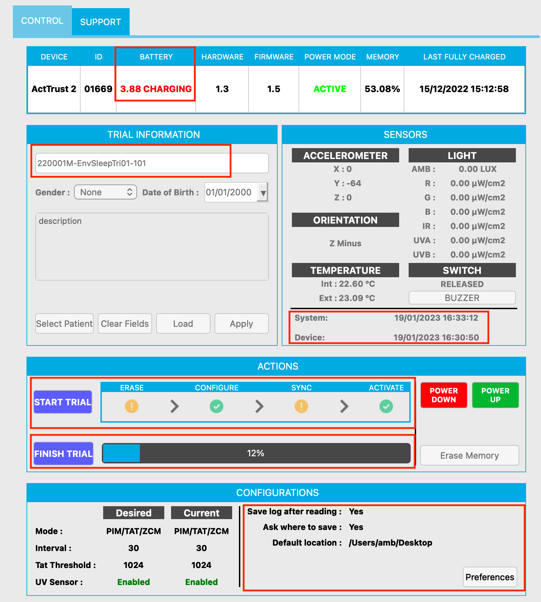
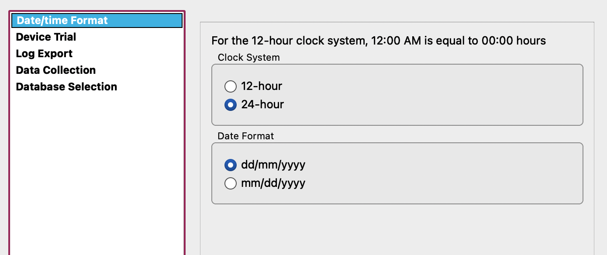
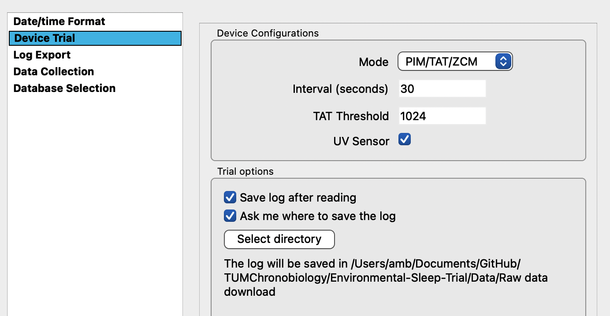
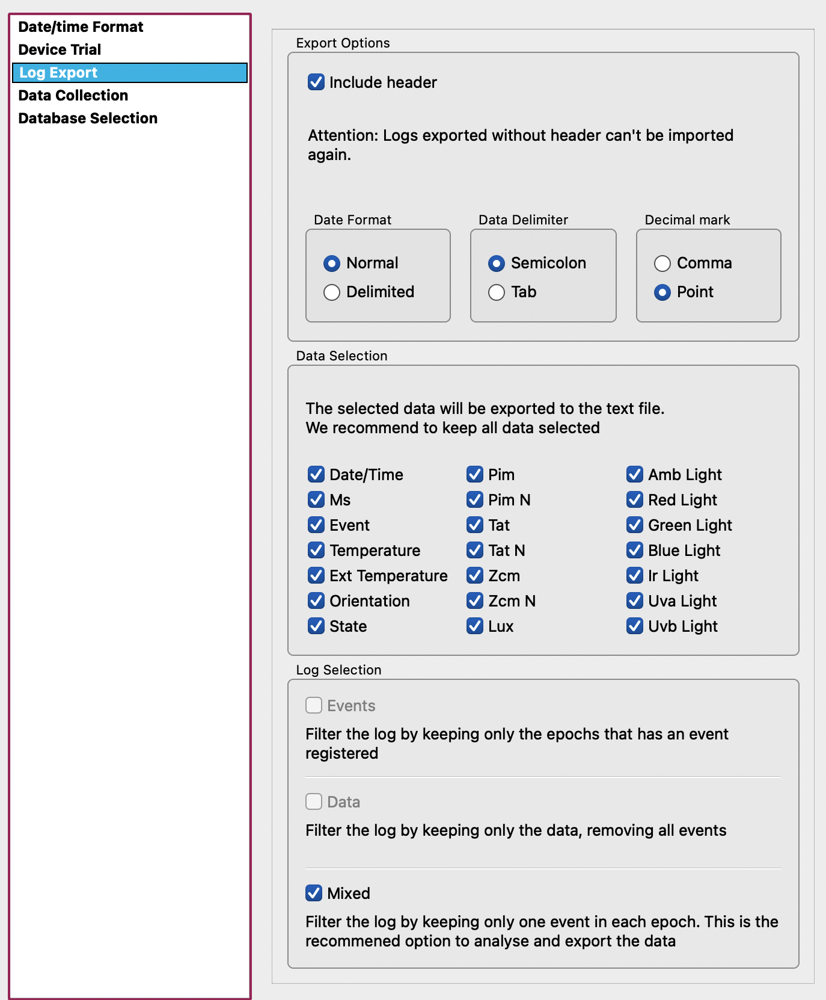
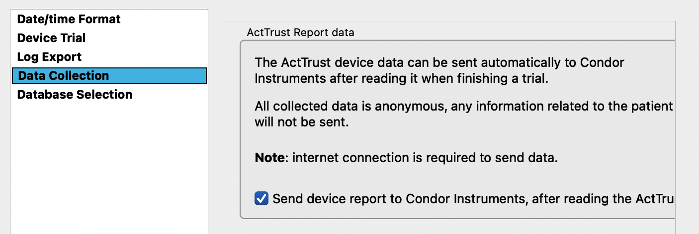
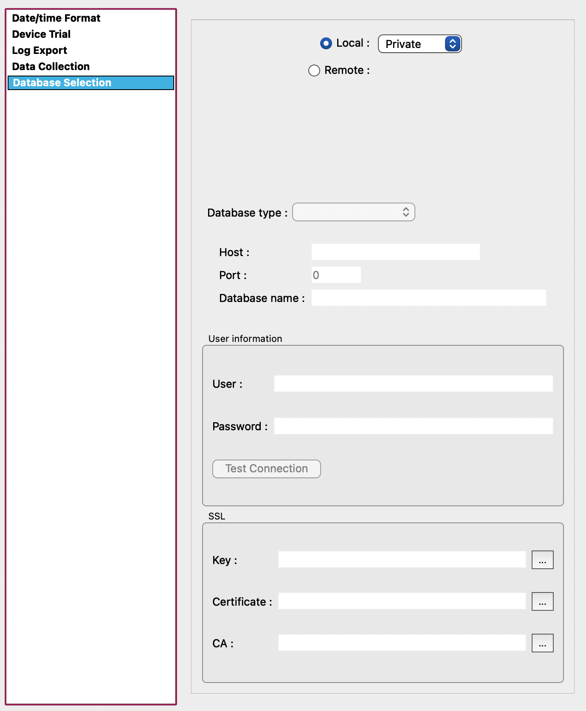
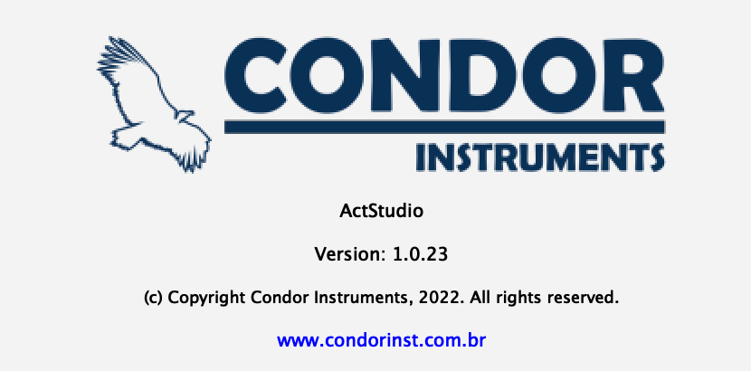
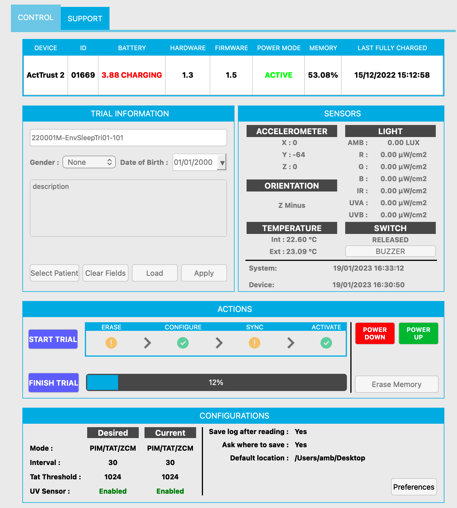
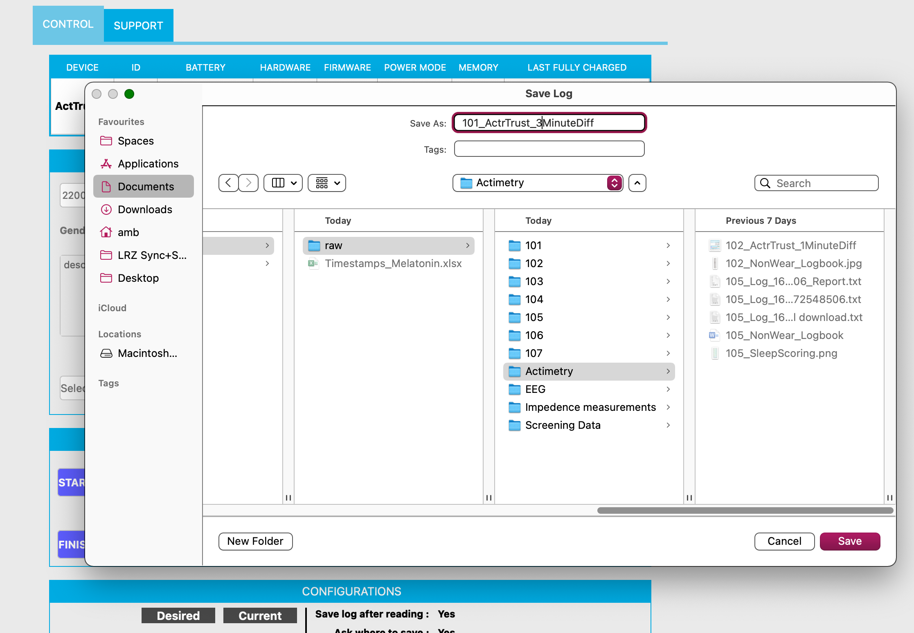
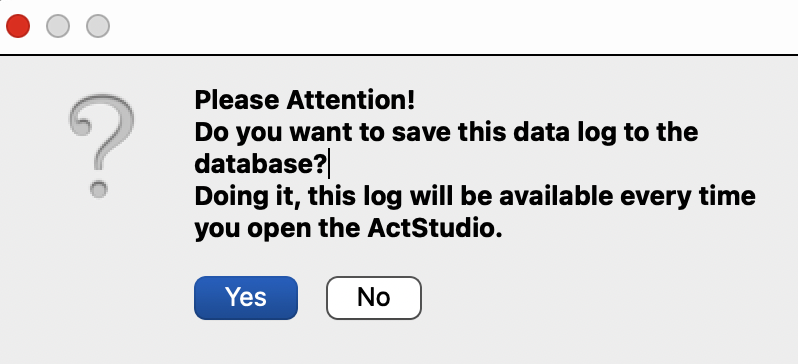

# Standard operating procedure for ActTrust2

1. Harmonization of setting up procedures
2. Harmonization of downloading the data
3. Instructions for participants: Press button when they take it off? Wear above sleeve?
    1. Standardized instructions
4. Version?
5. Processing of data
6. Where to put SOPs?
7. Time drift
    1. Systematic 

Next steps:

- Standard scoring manual developed by the lab (@Anna Biller to ask Lully about her instructions, @Manuel Spitschan to ask Katharina and Corrado)
- Timing drift from mid February
- Ask Nik and Jennifer to charge and prepare

**Act Studio SOPs**

Current version used: v.1.0.24

**Setting up a recording**

1. Open ActStudio
2. Connect your ActTrust with the computer (via cable and docking station)
3. (Potentially need to “power up” the device with the green button at the right bottom)
    
    
    
4. Change the name of the Participant ID under “Trial information” > name
    1. There are cases in which the Participant ID does not need to be specified, e.g. when there is no participant wearing the device in environmental measurements. In those cases, it would be recommended to use an identifier that is specific to the project.
5. Note down the device number and link it with the participant ID
6. Do not enter any additional information, e.g. gender or date of birth
7. Also, leave the description free unless absolutely necessary
8. View “Desired” and “Current” configurations to determine whether a change needs to be made in mode, intervals, threshold and UV sensor data collection.
9. Change the default preferences by going to “configurations” at the bottom of the page > click on preferences
10. A new window appears: set the default preferences as discussed and click apply  
    1. Note: The specific settings from acquisition are project-dependent and there is a trade-off between memory capacity and sampling. For most projects <1 month, 30 sec intervals are appropriate.
11. Default settings:
    
    
    
    
    
    
    
    
    
    
    
    
    
    1. Check the battery status and charge if necessary (wait until battery status turned green and says “charged”)
    2. Check if the system clock and the device clock are synchronised
    3. Now click “Start Trial” 
    4. Check at the bottom under “configurations” if the “desired” settings are similar to the “current” settings
    
    After disconnecting
    
    1. Note down in the Actimetry database that it was taken
    2. After the study, immediately connect the ActTrust so it stops recording
    
    **Data readout and download**
    
    1. Place ActTrust device into the docking station and connect cable to laptop/computer
    2. Open ActStudio
    3. Check whether the device is connected
        
        
        
    4. Check the clock difference from the device and the internal time of your machine under “system” vs “device” on the right side > note this down!
    5. Click “Finish Trial” > this loads the data
    6. Wait until 100% is downloaded (progress bar)
    7. In some cases: Possible a warning message appears which asks you whether you want to fill gaps in the data with 0s -> “Do nothing” to preserve missing periods of data (rather than imputing with 0). In a later analysis stage, this can be revisited and ActStudio will prompt you again.
        
        
        
    8. A new window opens > specify the file name and the path where to save it; this saves the raw data
        
        
        
    9. Another window opens: “Please attention: Do you want to add the data to the log” > Lock “Yes”. This stores the data in the local data base and you can always open it again without the need to upload the raw data file again
        
        
        
    10. Do NOT crop the data to valid periods in ActStudio by setting the initial and final times. Rather, this should be done with a separate file (start stop log file) to be loaded in pyActigraphy.
    
    **Visual inspection of data**
    
    1. Click on “Calculate Analysis”. This will generate metrics based on the data. This only has to be done once and the analyses will be available under “Analysis”.
    2. Under “Analysis”, a lot of lines are shown of different data. For the initial visual inspection, it is sufficient to select “Activity”, “Sleeping”, “Resting”, “OffWrist” and “Light”.
    
    
    
    1. Periods of “Awake” and “Sleep” will be scored by algorithm by ActStudio.
    
    Add: View data in ActStudio, either for visual inspection or as a check that the data are there. For quantitative analyses, we will pyActigraphy.